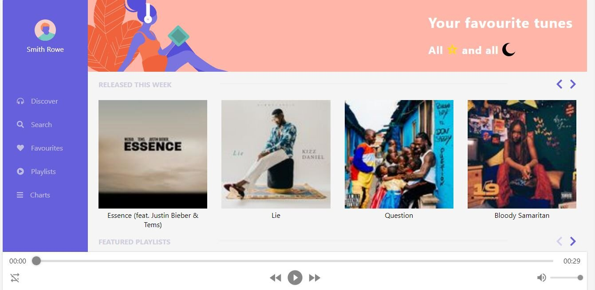

# INBEV react test solution

This is a solution to the frontend challenge

## Table of contents

- [Overview](#overview)
  - [The challenge](#the-challenge)
  - [Screenshot](#screenshot)
  - [Links](#links)
- [My process](#my-process)
  - [Built with](#built-with)
  - [What I learned](#what-i-learned)
  - [Continued development](#continued-development)
  - [Useful resources](#useful-resources)
- [Author](#author)

## Overview

This app is a front end app that was built with React Library and styled component. It involves the knowledge of API consumption.

### The challenge

Put your knowledge of:

- APIs consumption and responses handling to test
- state management and making efficient multiple API calls to test
- playing/pausing a music irrespective of the section the music is
- layout optimization for different device's screen size

### Screenshot



### Links

- Live Site URL: [https://inbev-test.herokuapp.com/](https://inbev-test.herokuapp.com/)

## My process

- Setup up the repo using create-react-app(Javascript template)
- Created components, commons and pages folder
- Created pagination in commons, error, loading, header, sidebar, player and single category in components and home in pages
- Created a context file for state management where screen size is monitored and APIs are fetched

- Used Promise.all to fetch the data from /new-releases, /featured_playlists and /categories since the three records are used simultaneously

- Had to set handle responses using setLoading and setError in the context
- Added function that handles audio selection in context

### Built with

- Semantic HTML5 markup
- CSS custom properties
- Flexbox
- Mobile-first workflow
- [React](https://reactjs.org/) - React framework
- [Styled Components](https://styled-components.com/) - For styles
- [Font Awesome](https://fontawesome.com/) - For icons

### What I learned

- I learnt how to use font awesome for spinner
- I learnt how to manage state with context API

```js
<div>
  <FontAwesomeIcon icon={faSpinner} spin />
</div>
```

### Continued development

- Keep using font awesome for some basic icons
- Keep learning context API along with redux

### Useful resources

- [useLayoutEffect hooks](https://reactjs.org/docs/hooks-reference.html#uselayouteffect) - This helped me monitor screen size. I really liked this pattern and will use it going forward.
- [Font awesome icon animation](https://fontawesome.com/v5.15/how-to-use/on-the-web/styling/animating-icons) - This is expose me to how to font awesome animation. It helps to prevent the use of extra package for spinner or lot of lines of css code.

## Author

- Website - [LinkedIn Profile](https://linkedin.com/in/teeliny)
